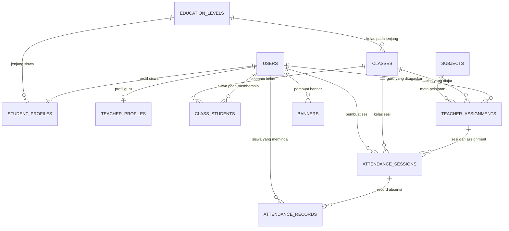

# Dokumentasi Database Kak Lia

Dokumen ini menjelaskan struktur database Kak Lia. Sumber utama definisi database adalah [`backend/prisma/schema.prisma`](../backend/prisma/schema.prisma). DDL SQL mandiri tersedia di [`QUERY.sql`](../QUERY.sql), sedangkan migration yang digunakan aplikasi berada di [`backend/prisma/migrations/20260917120000_init/migration.sql`](../backend/prisma/migrations/20260917120000_init/migration.sql) dan [`backend/prisma/migrations/20261003230130_admin_crud_soft_delete/migration.sql`](../backend/prisma/migrations/20261003230130_admin_crud_soft_delete/migration.sql).

Database menggunakan MySQL 8.0+ dan diakses oleh backend melalui Prisma ORM. `QUERY.sql` hanya berisi DDL tabel, index, dan foreign key; file tersebut tidak membuat database, user MySQL, mengisi data contoh, atau menjalankan query aplikasi.

## 1. Konvensi Database

- Semua nama tabel dan kolom menggunakan `snake_case`.
- Primary key bertipe `INTEGER` dengan `AUTO_INCREMENT`, kecuali tabel profil yang menggunakan `user_id` sebagai primary key dan foreign key.
- Timestamp disimpan sebagai UTC. `created_at` memiliki default `CURRENT_TIMESTAMP(6)`.
- `updated_at` tidak memiliki default database. Perubahan timestamp tersebut dilakukan oleh Prisma melalui `@updatedAt`.
- Semua tabel menggunakan `utf8mb4` dengan collation `utf8mb4_unicode_ci`.
- `BOOLEAN` direpresentasikan sebagai `BOOLEAN` MySQL dan ditulis sebagai `true`/`false` pada default.
- Relasi antar tabel menggunakan foreign key dengan `ON UPDATE CASCADE`.
- Penghapusan profil mengikuti `CASCADE`; relasi akademik, absensi, assignment, dan banner menggunakan `RESTRICT`.
- `users` dan `attendance_sessions` memakai soft delete melalui `deleted_at` (NULL = aktif); baris ter-soft-delete disembunyikan dari list/report dan tidak dapat dipindai (keputusan D21).
- Nilai enum database tetap menggunakan `HADIR`, `TERLAMBAT`, dan `TIDAK_HADIR`; label Bahasa Indonesia hanya ditampilkan pada boundary API/UI.

## 2. Ringkasan Tabel

Database terdiri dari 11 tabel:

| Tabel | Fungsi |
| --- | --- |
| `users` | Akun dan profil dasar seluruh role. |
| `student_profiles` | Data akademik siswa dan NIM. |
| `teacher_profiles` | Penanda akun yang memiliki profil guru. |
| `education_levels` | Master jenjang pendidikan. |
| `classes` | Master kelas pada jenjang pendidikan. |
| `subjects` | Master mata pelajaran. |
| `class_students` | Riwayat penempatan siswa ke kelas. |
| `teacher_assignments` | Penugasan guru untuk kelas dan mata pelajaran. |
| `attendance_sessions` | Sesi absensi dan payload QR. |
| `attendance_records` | Record hasil pemindaian siswa. |
| `banners` | Banner informasi/event sekolah. |

## 3. Diagram Relasi



## 4. Detail Struktur Tabel

### 4.1 `users`

Menyimpan akun dan data dasar untuk role `STUDENT`, `TEACHER`, atau `ADMIN`.

| Kolom | Tipe SQL | Null | Default/Constraint |
| --- | --- | --- | --- |
| `id` | `INTEGER` | Tidak | Primary key, `AUTO_INCREMENT` |
| `username` | `VARCHAR(100)` | Tidak | Unique |
| `password_hash` | `VARCHAR(255)` | Tidak | Wajib diisi |
| `role` | `ENUM('STUDENT', 'TEACHER', 'ADMIN')` | Tidak | Wajib diisi |
| `email` | `VARCHAR(255)` | Ya | Unique |
| `phone` | `VARCHAR(30)` | Ya | — |
| `birth_date` | `DATE` | Ya | — |
| `name` | `VARCHAR(150)` | Tidak | Wajib diisi |
| `created_at` | `TIMESTAMP(6)` | Tidak | `CURRENT_TIMESTAMP(6)` |
| `updated_at` | `TIMESTAMP(6)` | Tidak | Diperbarui Prisma |
| `deleted_at` | `TIMESTAMP(6)` | Ya | Soft delete; NULL = aktif |

Relasi: satu user dapat memiliki maksimal satu `student_profiles`, satu `teacher_profiles`, banyak `class_students`, banyak `teacher_assignments`, banyak `attendance_sessions`, banyak `attendance_records`, dan banyak `banners`.

### 4.2 `student_profiles`

Menyimpan data akademik khusus siswa. `user_id` sekaligus menjadi primary key dan foreign key ke `users`.

| Kolom | Tipe SQL | Null | Default/Constraint |
| --- | --- | --- | --- |
| `user_id` | `INTEGER` | Tidak | Primary key, FK ke `users.id` |
| `student_number` | `VARCHAR(50)` | Tidak | Unique |
| `education_level_id` | `INTEGER` | Tidak | FK ke `education_levels.id` |

### 4.3 `teacher_profiles`

Menandai user yang memiliki profil guru. Tabel ini tidak memiliki kolom tambahan selain relasi user.

| Kolom | Tipe SQL | Null | Default/Constraint |
| --- | --- | --- | --- |
| `user_id` | `INTEGER` | Tidak | Primary key, FK ke `users.id` |

### 4.4 `education_levels`

Menyimpan master jenjang pendidikan.

| Kolom | Tipe SQL | Null | Default/Constraint |
| --- | --- | --- | --- |
| `id` | `INTEGER` | Tidak | Primary key, `AUTO_INCREMENT` |
| `name` | `VARCHAR(100)` | Tidak | Unique |
| `created_at` | `TIMESTAMP(6)` | Tidak | `CURRENT_TIMESTAMP(6)` |
| `updated_at` | `TIMESTAMP(6)` | Tidak | Diperbarui Prisma |

### 4.5 `classes`

Menyimpan kelas yang berada pada suatu jenjang pendidikan. Nama kelas unik dalam satu jenjang.

| Kolom | Tipe SQL | Null | Default/Constraint |
| --- | --- | --- | --- |
| `id` | `INTEGER` | Tidak | Primary key, `AUTO_INCREMENT` |
| `name` | `VARCHAR(100)` | Tidak | Wajib diisi |
| `education_level_id` | `INTEGER` | Tidak | FK ke `education_levels.id` |
| `created_at` | `TIMESTAMP(6)` | Tidak | `CURRENT_TIMESTAMP(6)` |
| `updated_at` | `TIMESTAMP(6)` | Tidak | Diperbarui Prisma |

### 4.6 `subjects`

Menyimpan master mata pelajaran.

| Kolom | Tipe SQL | Null | Default/Constraint |
| --- | --- | --- | --- |
| `id` | `INTEGER` | Tidak | Primary key, `AUTO_INCREMENT` |
| `name` | `VARCHAR(150)` | Tidak | Unique |
| `created_at` | `TIMESTAMP(6)` | Tidak | `CURRENT_TIMESTAMP(6)` |
| `updated_at` | `TIMESTAMP(6)` | Tidak | Diperbarui Prisma |

### 4.7 `class_students`

Menyimpan penempatan siswa ke kelas. Baris dengan `is_active = false` merupakan penempatan historis.

| Kolom | Tipe SQL | Null | Default/Constraint |
| --- | --- | --- | --- |
| `id` | `INTEGER` | Tidak | Primary key, `AUTO_INCREMENT` |
| `class_id` | `INTEGER` | Tidak | FK ke `classes.id` |
| `student_id` | `INTEGER` | Tidak | FK ke `users.id` |
| `is_active` | `BOOLEAN` | Tidak | `true` |
| `created_at` | `TIMESTAMP(6)` | Tidak | `CURRENT_TIMESTAMP(6)` |
| `updated_at` | `TIMESTAMP(6)` | Tidak | Diperbarui Prisma |

### 4.8 `teacher_assignments`

Menyimpan penugasan guru untuk sebuah kelas dan mata pelajaran.

| Kolom | Tipe SQL | Null | Default/Constraint |
| --- | --- | --- | --- |
| `id` | `INTEGER` | Tidak | Primary key, `AUTO_INCREMENT` |
| `teacher_id` | `INTEGER` | Tidak | FK ke `users.id` |
| `class_id` | `INTEGER` | Tidak | FK ke `classes.id` |
| `subject_id` | `INTEGER` | Tidak | FK ke `subjects.id` |
| `is_active` | `BOOLEAN` | Tidak | `true` |
| `created_at` | `TIMESTAMP(6)` | Tidak | `CURRENT_TIMESTAMP(6)` |
| `updated_at` | `TIMESTAMP(6)` | Tidak | Diperbarui Prisma |

### 4.9 `attendance_sessions`

Menyapkan sesi absensi statis beserta rentang waktu dan payload QR.

| Kolom | Tipe SQL | Null | Default/Constraint |
| --- | --- | --- | --- |
| `id` | `INTEGER` | Tidak | Primary key, `AUTO_INCREMENT` |
| `assignment_id` | `INTEGER` | Tidak | FK ke `teacher_assignments.id` |
| `class_id` | `INTEGER` | Tidak | FK ke `classes.id` |
| `session_date` | `DATE` | Tidak | Tanggal sesi menurut timezone sekolah |
| `start_at` | `TIMESTAMP(6)` | Tidak | UTC |
| `end_at` | `TIMESTAMP(6)` | Tidak | UTC |
| `qr_payload` | `VARCHAR(255)` | Tidak | Unique |
| `created_by` | `INTEGER` | Tidak | FK ke `users.id` |
| `created_at` | `TIMESTAMP(6)` | Tidak | `CURRENT_TIMESTAMP(6)` |
| `updated_at` | `TIMESTAMP(6)` | Tidak | Diperbarui Prisma |
| `deleted_at` | `TIMESTAMP(6)` | Ya | Soft delete; NULL = aktif |

### 4.10 `attendance_records`

Menyimpan satu record hasil scan siswa per sesi. Record ini adalah sumber data scan; status `TIDAK_HADIR` dihitung saat pembacaan, bukan disimpan melalui alur scan.

| Kolom | Tipe SQL | Null | Default/Constraint |
| --- | --- | --- | --- |
| `id` | `INTEGER` | Tidak | Primary key, `AUTO_INCREMENT` |
| `session_id` | `INTEGER` | Tidak | FK ke `attendance_sessions.id` |
| `student_id` | `INTEGER` | Tidak | FK ke `users.id` |
| `scanned_at` | `TIMESTAMP(6)` | Tidak | Waktu server, UTC |
| `status` | `ENUM('HADIR', 'TERLAMBAT', 'TIDAK_HADIR', 'IZIN', 'SAKIT', 'ALFA', 'DISPEN')` | Tidak | Wajib diisi |
| `late_minutes` | `INTEGER UNSIGNED` | Ya | Menit keterlambatan |
| `created_at` | `TIMESTAMP(6)` | Tidak | `CURRENT_TIMESTAMP(6)` |
| `updated_at` | `TIMESTAMP(6)` | Tidak | Diperbarui Prisma |

### 4.11 `attendance_status_overrides`

Menyimpan status manual guru (`IZIN`/`SAKIT`/`ALFA`/`DISPEN`) per `(sesi, siswa)`. Override hanya berlaku selama siswa belum scan; begitu ada `attendance_records`, status scan (`HADIR`/`TERLAMBAT`) yang menang. Tanpa record maupun override, status dihitung (`TIDAK_HADIR`) atau `null`.

| Kolom | Tipe SQL | Null | Default/Constraint |
| --- | --- | --- | --- |
| `id` | `INTEGER` | Tidak | Primary key, `AUTO_INCREMENT` |
| `session_id` | `INTEGER` | Tidak | FK ke `attendance_sessions.id` |
| `student_id` | `INTEGER` | Tidak | FK ke `users.id` |
| `status` | `ENUM('HADIR', 'TERLAMBAT', 'TIDAK_HADIR', 'IZIN', 'SAKIT', 'ALFA', 'DISPEN')` | Tidak | Wajib diisi |
| `created_by` | `INTEGER` | Tidak | FK ke `users.id` (guru pembuat) |
| `created_at` | `TIMESTAMP(6)` | Tidak | `CURRENT_TIMESTAMP(6)` |
| `updated_at` | `TIMESTAMP(6)` | Tidak | Diperbarui Prisma |

Unique `(session_id, student_id)` untuk idempotensi; index pada `student_id` dan `(session_id, status)`.

### 4.12 `banners`

Menyimpan banner informasi/event yang dapat ditampilkan pada beranda.

| Kolom | Tipe SQL | Null | Default/Constraint |
| --- | --- | --- | --- |
| `id` | `INTEGER` | Tidak | Primary key, `AUTO_INCREMENT` |
| `title` | `VARCHAR(200)` | Tidak | Wajib diisi |
| `image_url` | `VARCHAR(500)` | Ya | URL atau path gambar |
| `content` | `TEXT` | Ya | Teks banner |
| `is_active` | `BOOLEAN` | Tidak | `false` |
| `display_start_at` | `TIMESTAMP(6)` | Ya | Awal periode tampil, UTC |
| `display_end_at` | `TIMESTAMP(6)` | Ya | Akhir periode tampil, UTC |
| `created_by` | `INTEGER` | Tidak | FK ke `users.id` |
| `created_at` | `TIMESTAMP(6)` | Tidak | `CURRENT_TIMESTAMP(6)` |
| `updated_at` | `TIMESTAMP(6)` | Tidak | Diperbarui Prisma |

## 5. Enum

### `UserRole`

Nilai yang diperbolehkan pada `users.role`:

- `STUDENT`
- `TEACHER`
- `ADMIN`

### `AttendanceStatus`

Nilai enum pada `attendance_records.status` dan `attendance_status_overrides.status`:

- `HADIR`
- `TERLAMBAT`
- `TIDAK_HADIR`
- `IZIN`
- `SAKIT`
- `ALFA`
- `DISPEN`

Menurut aturan domain yang sudah dikunci, record yang dibuat oleh scan hanya menggunakan `HADIR` atau `TERLAMBAT`. `TIDAK_HADIR` dihitung pada saat history/report dibaca untuk siswa aktif pada kelas sesi yang belum memiliki record. `IZIN`/`SAKIT`/`ALFA`/`DISPEN` hanya dibuat melalui input manual guru pada `attendance_status_overrides`. Karena itu, enum tetap menyediakan nilai tersebut untuk kontrak domain, tetapi tidak boleh dibuat oleh alur scan.

## 6. Unique Constraint dan Index

### Unique constraint

- `users.username`
- `users.email`
- `student_profiles.student_number`
- `education_levels.name`
- `classes (education_level_id, name)`
- `subjects.name`
- `class_students (class_id, student_id, is_active)`
- `teacher_assignments (teacher_id, class_id, subject_id, is_active)`
- `attendance_sessions.qr_payload`
- `attendance_sessions (assignment_id, session_date, start_at, end_at)`
- `attendance_records (session_id, student_id)`
- `attendance_status_overrides (session_id, student_id)`

### Index pendukung

- `users.email`
- `users.role`
- `users.deleted_at`
- `student_profiles.education_level_id`
- `classes.education_level_id`
- `class_students (student_id, is_active)`
- `class_students (class_id, is_active)`
- `teacher_assignments (teacher_id, is_active)`
- `teacher_assignments (class_id, is_active)`
- `teacher_assignments (subject_id, is_active)`
- `attendance_sessions (assignment_id, start_at, end_at)`
- `attendance_sessions (class_id, session_date)`
- `attendance_sessions.deleted_at`
- `attendance_records (student_id, scanned_at)`
- `attendance_records (session_id, status)`
- `banners (is_active, display_start_at, display_end_at)`
- `banners.created_by`

## 7. Foreign Key

| Tabel anak | Kolom | Tabel induk | `ON DELETE` | `ON UPDATE` |
| --- | --- | --- | --- | --- |
| `teacher_profiles` | `user_id` | `users` | `CASCADE` | `CASCADE` |
| `student_profiles` | `user_id` | `users` | `CASCADE` | `CASCADE` |
| `student_profiles` | `education_level_id` | `education_levels` | `RESTRICT` | `CASCADE` |
| `classes` | `education_level_id` | `education_levels` | `RESTRICT` | `CASCADE` |
| `class_students` | `class_id` | `classes` | `RESTRICT` | `CASCADE` |
| `class_students` | `student_id` | `users` | `RESTRICT` | `CASCADE` |
| `teacher_assignments` | `teacher_id` | `users` | `RESTRICT` | `CASCADE` |
| `teacher_assignments` | `class_id` | `classes` | `RESTRICT` | `CASCADE` |
| `teacher_assignments` | `subject_id` | `subjects` | `RESTRICT` | `CASCADE` |
| `attendance_sessions` | `assignment_id` | `teacher_assignments` | `RESTRICT` | `CASCADE` |
| `attendance_sessions` | `class_id` | `classes` | `RESTRICT` | `CASCADE` |
| `attendance_sessions` | `created_by` | `users` | `RESTRICT` | `CASCADE` |
| `attendance_records` | `session_id` | `attendance_sessions` | `RESTRICT` | `CASCADE` |
| `attendance_records` | `student_id` | `users` | `RESTRICT` | `CASCADE` |
| `banners` | `created_by` | `users` | `RESTRICT` | `CASCADE` |

## 8. Aturan Integritas Absensi

Aturan berikut ditegakkan oleh kombinasi constraint database dan service backend:

1. Jendela scan adalah `start_at - 15 menit` sampai `end_at`.
2. Scan dari awal jendela sampai `start_at + 15 menit` menghasilkan `HADIR` dengan `late_minutes` nol.
3. Scan setelah `start_at + 15 menit` sampai `end_at` menghasilkan `TERLAMBAT` dengan selisih menit keterlambatan.
4. Scan di luar jendela ditolak tanpa membuat record.
5. Unique constraint `(session_id, student_id)` membuat scan berulang idempoten dan mencegah dua record untuk pasangan yang sama.
6. Sesi dengan assignment, tanggal, dan pasangan waktu yang sama ditolak oleh unique constraint dan contract `DUPLICATE_ATTENDANCE_SESSION`.
7. `TIDAK_HADIR` tidak dibuat oleh scan; nilainya dihitung saat pembacaan.
8. Validasi `end_at > start_at`, periode banner, konsistensi role/profil, dan konsistensi assignment tetap dilakukan pada service karena belum direpresentasikan sebagai check constraint MySQL.
9. Aturan satu kelas aktif per siswa divalidasi pada service. Unique constraint `(class_id, student_id, is_active)` melindungi duplikasi penempatan pada kelas yang sama, tetapi tidak secara langsung melarang satu siswa memiliki membership aktif pada dua kelas berbeda.

## 9. Timezone dan Tanggal

- Semua `TIMESTAMP(6)` disimpan dalam UTC.
- `session_date` adalah kolom `DATE` dan ditafsirkan sebagai tanggal kalender pada timezone sekolah, yang default-nya `Asia/Jakarta` dan dapat dikonfigurasi melalui `SCHOOL_TIMEZONE`.
- `start_at`, `end_at`, `scanned_at`, `display_start_at`, dan `display_end_at` dikonversi ke timezone sekolah pada service dan response boundary.
- Waktu scan selalu berasal dari server dan tidak mempercayai timestamp client.

## 10. Menjalankan Migration dan SQL DDL

### Menggunakan Prisma Migration

Jalankan dari direktori `backend/`:

```bash
npx prisma migrate deploy
npm run prisma:seed
```

`npm run prisma:seed` hanya untuk development, idempotent, dan menolak `NODE_ENV=production`. Seed tidak termasuk dalam `QUERY.sql`.

Untuk database development baru, gunakan `npx prisma migrate dev` sesuai prosedur repository. Jangan menjalankan `prisma migrate reset --force` pada production.

### Menggunakan `QUERY.sql`

`QUERY.sql` adalah DDL mandiri yang harus dijalankan pada database MySQL yang sudah dibuat dan dipilih. File tersebut tidak membuat database, user, atau data awal. Jangan menjalankan `QUERY.sql` bersamaan dengan migration Prisma pada database yang sama.

Contoh eksekusi generik:

```bash
mysql --database=<nama_database> < ../QUERY.sql
```

Setelah migration atau DDL diterapkan, backend tetap menggunakan Prisma Migrate sebagai sumber perubahan schema. `QUERY.sql` harus diperbarui bila ada migration baru.

## 11. Kebijakan Perubahan Schema

1. Ubah `backend/prisma/schema.prisma` sebagai sumber definisi.
2. Buat migration Prisma; jangan mengedit migration lama secara manual.
3. Perbarui `QUERY.sql` agar tetap mencerminkan migration terbaru.
4. Perbarui dokumen ini bila kolom, constraint, index, enum, atau aturan integritas berubah.
5. Catat keputusan produk atau perubahan aturan database di `docs/DECISIONS.md` sebelum menerapkan perubahan yang belum diputuskan.
